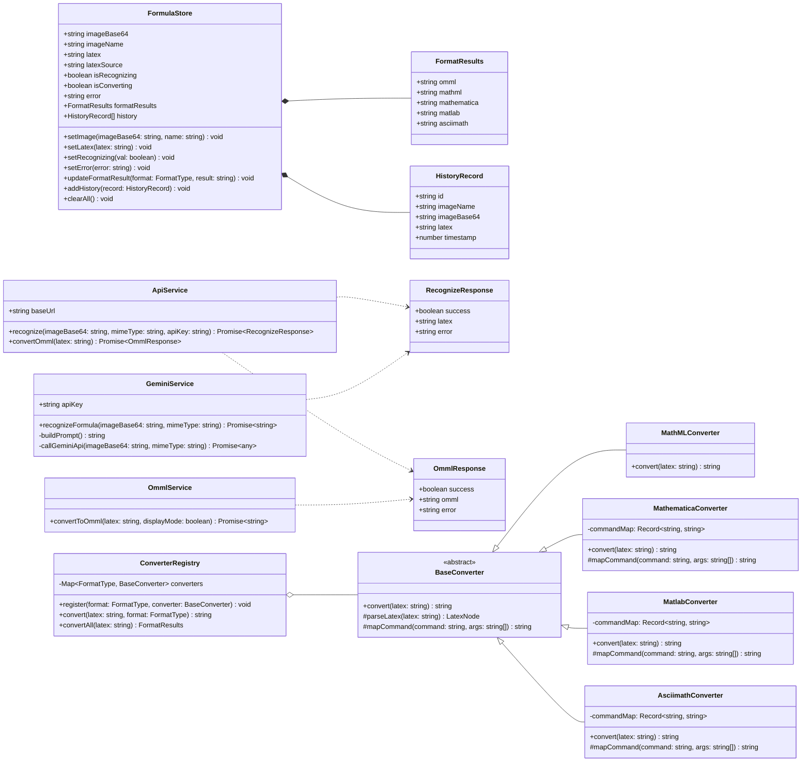
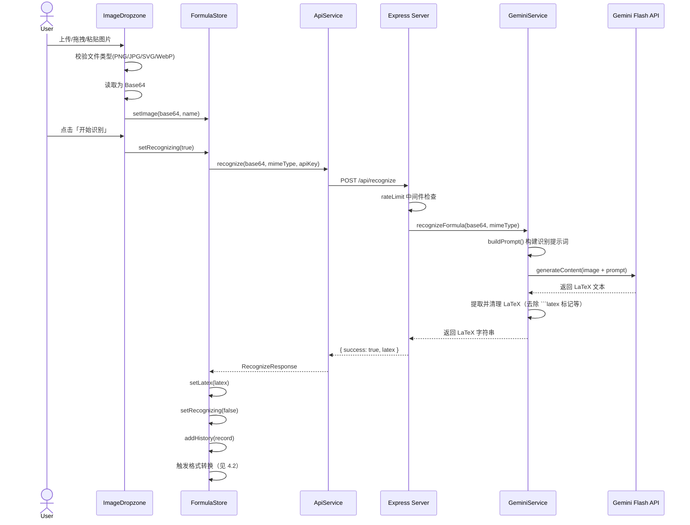
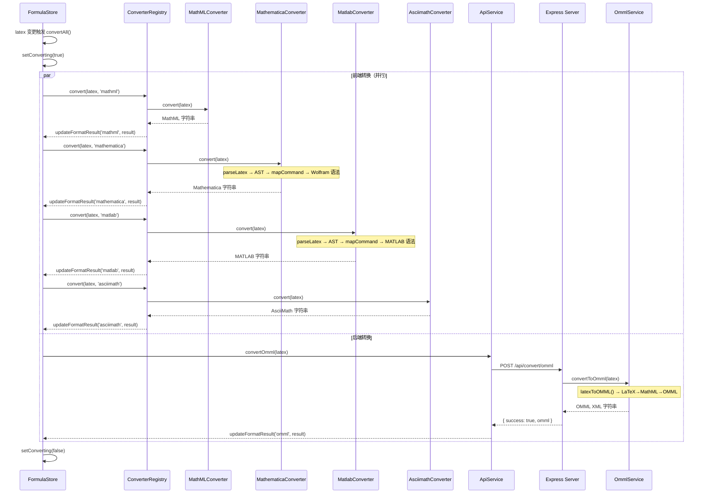
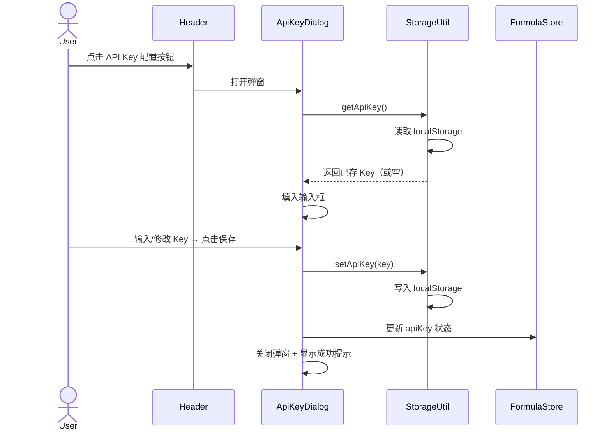
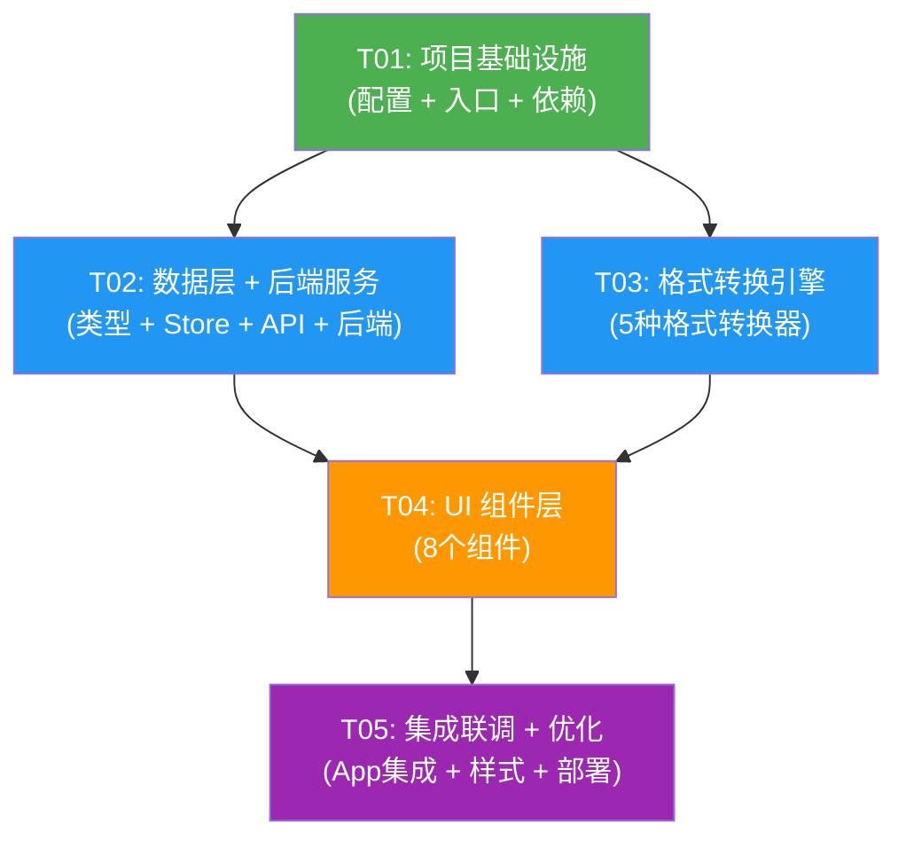

# FormulaOCR - 系统架构设计文档

> 架构师：高见远（Gao） | 基于 PRD v1.0

---

## Part A: 系统设计

### 1. 实现方案与框架选型

#### 1.1 核心技术挑战

| 挑战 | 难度 | 解决方案 |
|------|------|----------|
| LaTeX → OMML 转换 | **高** | `latex-to-omml`（Node.js 库，内部经 LaTeX→MathML→OMML 两步转换，依赖 mathjax-node + mathml2omml），必须在后端运行 |
| LaTeX → Mathematica 转换 | **高** | 无现成 JS 库，需自建递归下降解析器 + 命令映射表，将 LaTeX AST 转为 Wolfram Language 语法 |
| LaTeX → MATLAB 转换 | **中高** | 同 Mathematica，自建映射表，转为 Symbolic Math Toolbox / MuPAD 语法 |
| LaTeX → AsciiMath 转换 | **中** | 自建映射表，AsciiMath 语法相对简单，大部分为符号替换 |
| Gemini API Key 安全 | **中** | 后端代理转发，Key 仅存于后端环境变量，前端不接触 |
| 图片多种输入方式 | **低** | react-dropzone 处理拖拽/点击，ClipboardEvent 处理粘贴 |

#### 1.2 框架与库选型

| 层面 | 技术 | 选型理由 |
|------|------|----------|
| **前端框架** | React 18 + TypeScript | 组件化开发、类型安全、生态成熟 |
| **构建工具** | Vite 5 | 极速 HMR、原生 ESM、开箱即用 |
| **UI 组件库** | MUI 5 + Tailwind CSS | MUI 提供复杂交互组件（Dialog/Tabs/Snackbar），Tailwind 处理快速布局与自定义样式 |
| **状态管理** | Zustand | 轻量（~1KB）、无 boilerplate、TypeScript 友好 |
| **LaTeX 预览** | KaTeX | 渲染速度快（比 MathJax 快 10x+）、无需网络请求 |
| **LaTeX → MathML** | Temml | 零依赖、轻量级 LaTeX→MathML 转换库，浏览器端直接运行 |
| **LaTeX → OMML** | latex-to-omml（后端） | 唯一成熟的 JS 生态 OMML 转换方案，内部使用 mathjax-node + mathml2omml |
| **图片上传** | react-dropzone | 拖拽/点击上传标准方案，支持文件类型校验 |
| **后端框架** | Express + TypeScript | 轻量、灵活、TypeScript 支持好 |
| **API 代理** | @google/generative-ai | Google 官方 Generative AI SDK，支持 Gemini Flash 多模态调用 |
| **部署** | 前端 Vercel + 后端 Railway | Vercel 免费 SPA 托管，Railway 支持持久进程（mathjax-node 初始化需要） |

#### 1.3 架构模式

采用 **前后端分离 + 前端为主** 的架构：

```
┌─────────────────────────────────────────────────────┐
│                    浏览器 (SPA)                       │
│  ┌───────────┐ ┌──────────┐ ┌────────────────────┐  │
│  │ 图片输入   │ │LaTeX编辑 │ │ 格式转换引擎(前端)  │  │
│  │Dropzone   │ │+KaTeX预览│ │ MathML/Mathematica │  │
│  │ +Paste    │ │          │ │ MATLAB/AsciiMath   │  │
│  └─────┬─────┘ └────┬─────┘ └────────────────────┘  │
│        │            │                                │
│        ▼            ▼                                │
│  ┌──────────────────────────┐                        │
│  │     Zustand Store        │                        │
│  │  (image/latex/formats)   │                        │
│  └────────────┬─────────────┘                        │
│               │                                      │
└───────────────┼──────────────────────────────────────┘
                │ HTTP
                ▼
┌───────────────────────────────────────────────────────┐
│              Railway (Express Server)                  │
│  ┌────────────────┐  ┌───────────────────────┐       │
│  │ /api/recognize │  │ /api/convert/omml     │       │
│  │ Gemini Proxy   │  │ latex-to-omml 转换     │       │
│  └───────┬────────┘  └───────────────────────┘       │
│          │                                             │
│          ▼                                             │
│  ┌────────────────┐                                   │
│  │ Gemini Flash   │                                   │
│  │ API            │                                   │
│  └────────────────┘                                   │
└───────────────────────────────────────────────────────┘
```

**核心设计决策**：
- 格式转换尽量在前端完成（4/5 种格式），减少后端负载和网络延迟
- OMML 转换因依赖 `mathjax-node`（Node.js only）放在后端
- 后端仅做两件事：Gemini API 代理 + OMML 转换

---

### 2. 文件列表

```
formula-ocr/
├── client/                              # 前端项目
│   ├── index.html                       # HTML 入口
│   ├── package.json                     # 前端依赖声明
│   ├── vite.config.ts                   # Vite 配置（含 API 代理）
│   ├── tsconfig.json                    # TypeScript 配置
│   ├── tsconfig.node.json               # Node 环境 TS 配置
│   ├── tailwind.config.ts               # Tailwind 配置
│   ├── postcss.config.js                # PostCSS 配置
│   ├── public/
│   │   └── favicon.svg                  # 网站图标
│   └── src/
│       ├── main.tsx                     # React 入口
│       ├── App.tsx                      # 根组件（布局 + 路由）
│       ├── vite-env.d.ts                # Vite 类型声明
│       ├── components/
│       │   ├── Header.tsx               # 顶部栏（标题 + API Key 入口 + 使用说明）
│       │   ├── ImageDropzone.tsx        # 图片输入区（拖拽/点击/粘贴）
│       │   ├── LatexEditor.tsx          # LaTeX 编辑文本框
│       │   ├── FormulaPreview.tsx       # KaTeX 公式预览区
│       │   ├── FormatConverter.tsx      # 格式转换结果区（Tabs 容器）
│       │   ├── FormatCard.tsx           # 单个格式结果卡片（代码 + 复制按钮）
│       │   ├── ApiKeyDialog.tsx         # API Key 配置弹窗
│       │   └── HistoryPanel.tsx         # 识别历史面板
│       ├── converters/
│       │   ├── index.ts                 # 转换器统一入口
│       │   ├── mathmlConverter.ts       # LaTeX → MathML（基于 Temml）
│       │   ├── mathematicaConverter.ts  # LaTeX → Mathematica（自建映射）
│       │   ├── matlabConverter.ts       # LaTeX → MATLAB（自建映射）
│       │   └── asciimathConverter.ts    # LaTeX → AsciiMath（自建映射）
│       ├── store/
│       │   └── useFormulaStore.ts       # Zustand 全局状态
│       ├── services/
│       │   └── api.ts                   # API 调用封装
│       ├── types/
│       │   └── index.ts                 # TypeScript 类型定义
│       └── utils/
│           ├── clipboard.ts             # 剪贴板操作工具
│           └── storage.ts               # localStorage 封装
├── server/                              # 后端项目
│   ├── package.json                     # 后端依赖声明
│   ├── tsconfig.json                    # TypeScript 配置
│   └── src/
│       ├── index.ts                     # Express 入口（启动 + 中间件挂载）
│       ├── routes/
│       │   ├── recognize.ts             # POST /api/recognize
│       │   └── convert.ts              # POST /api/convert/omml
│       ├── services/
│       │   ├── geminiService.ts         # Gemini API 调用封装
│       │   └── ommlService.ts           # OMML 转换服务
│       └── middleware/
│           ├── rateLimit.ts             # 速率限制中间件
│           └── errorHandler.ts          # 全局错误处理
├── docs/
│   ├── ARCHITECTURE.md                  # 本文档
│   ├── PRD.md                           # 产品需求文档
│   ├── sequence-diagram.mermaid         # 时序图
│   └── class-diagram.mermaid            # 类图
└── README.md                            # 项目说明
```

---

### 3. 数据结构与接口

#### 3.1 类图



#### 3.2 核心 TypeScript 类型定义

```typescript
// 支持的格式类型
type FormatType = 'omml' | 'mathml' | 'mathematica' | 'matlab' | 'asciimath';

// 格式转换结果
interface FormatResults {
  omml: string;
  mathml: string;
  mathematica: string;
  matlab: string;
  asciimath: string;
}

// 识别历史记录
interface HistoryRecord {
  id: string;
  imageName: string;
  imageBase64: string;
  latex: string;
  timestamp: number;
}

// API 响应格式
interface RecognizeResponse {
  success: boolean;
  latex: string;
  error?: string;
}

interface OmmlResponse {
  success: boolean;
  omml: string;
  error?: string;
}

// 请求体
interface RecognizeRequest {
  imageBase64: string;
  mimeType: string;
  apiKey?: string;  // 可选，后端可能使用环境变量中的 key
}

interface OmmlConvertRequest {
  latex: string;
  displayMode?: boolean;
}
```

#### 3.3 API 接口定义

| 接口 | 方法 | 路径 | 请求体 | 响应体 | 说明 |
|------|------|------|--------|--------|------|
| 公式识别 | POST | `/api/recognize` | `{ imageBase64, mimeType, apiKey? }` | `{ success, latex, error? }` | 图片 → LaTeX |
| OMML 转换 | POST | `/api/convert/omml` | `{ latex, displayMode? }` | `{ success, omml, error? }` | LaTeX → OMML |

#### 3.4 LaTeX 解析 AST 节点（自定义转换器内部使用）

```typescript
// LaTeX AST 节点类型
type LatexNode =
  | { type: 'text'; value: string }
  | { type: 'command'; name: string; args: LatexNode[][] }
  | { type: 'superscript'; base: LatexNode; sup: LatexNode }
  | { type: 'subscript'; base: LatexNode; sub: LatexNode }
  | { type: 'group'; children: LatexNode[] }
  | { type: 'environment'; name: string; args: LatexNode[][]; body: LatexNode[] };
```

---

### 4. 程序调用流程

#### 4.1 图片识别流程



#### 4.2 格式转换流程



#### 4.3 API Key 配置流程



---

### 5. 待明确事项

| # | 问题 | 当前假设 | 建议 |
|---|------|----------|------|
| 1 | LaTeX → Mathematica / MATLAB 转换的覆盖范围？ | 先覆盖常见公式（分数、根号、上下标、积分、求和、希腊字母、矩阵），复杂命令后续迭代 | 建议产品经理定义优先级最高的 LaTeX 命令集 |
| 2 | Gemini API 免费额度是否需要前端限额？ | 暂不实现前端限额，仅后端速率限制（60次/分钟/IP） | 建议在 UI 显示当前日用量提示 |
| 3 | 后端是否需要速率限制？ | 需要，使用 express-rate-limit，按 IP 限制 60次/分钟 | 可根据实际使用调整 |
| 4 | LaTeX 编辑区是否需要语法高亮？ | 暂不实现，使用简单 textarea | P2 阶段可引入 CodeMirror |
| 5 | 手写公式识别？ | 依赖 Gemini Flash 的自然识别能力，不做特殊处理 | 可在 prompt 中引导识别手写体 |
| 6 | `latex-to-omml` 在 serverless 环境下的冷启动性能？ | 首次调用 mathjax-node 初始化需 2-3 秒，后续调用快速 | 使用 Railway 持久进程而非 serverless |
| 7 | API Key 由前端传入还是后端环境变量？ | 支持两种模式：后端环境变量优先，前端 Key 作为 fallback | 便于用户自助使用 |
| 8 | Vercel + Railway 的跨域配置？ | 后端配置 CORS 允许 Vercel 域名 | 部署时具体配置 |

---

## Part B: 任务分解

### 6. 依赖包列表

#### 前端 (client/package.json)

```
- react@^18.2.0: UI 框架
- react-dom@^18.2.0: React DOM 渲染
- @mui/material@^5.14.0: MUI 组件库
- @mui/icons-material@^5.14.0: MUI 图标库
- @emotion/react@^11.11.0: MUI 样式引擎
- @emotion/styled@^11.11.0: MUI 样式引擎
- zustand@^4.5.0: 状态管理
- katex@^0.16.9: LaTeX 公式渲染预览
- temml@^0.10.0: LaTeX → MathML 转换
- react-dropzone@^14.2.0: 文件拖拽上传
- typescript@^5.3.0: 类型系统
- @types/react@^18.2.0: React 类型定义
- @types/react-dom@^18.2.0: React DOM 类型定义
- @vitejs/plugin-react@^4.2.0: Vite React 插件
- vite@^5.0.0: 构建工具
- tailwindcss@^3.4.0: 原子化 CSS 框架
- postcss@^8.4.0: CSS 处理
- autoprefixer@^10.4.0: CSS 前缀自动补全
```

#### 后端 (server/package.json)

```
- express@^4.18.0: Web 框架
- cors@^2.8.5: 跨域中间件
- @google/generative-ai@^0.15.0: Google Generative AI SDK（Gemini）
- latex-to-omml@^2.1.0: LaTeX → OMML 转换
- express-rate-limit@^7.1.0: 速率限制中间件
- typescript@^5.3.0: 类型系统
- @types/express@^4.17.0: Express 类型定义
- @types/cors@^2.8.0: CORS 类型定义
- tsx@^4.7.0: TypeScript 执行器（开发用）
```

---

### 7. 任务列表

#### T01: 项目基础设施

| 字段 | 值 |
|------|------|
| **Task ID** | T01 |
| **Task Name** | 项目基础设施（配置文件 + 入口文件 + 依赖声明） |
| **Source Files** | `client/package.json`, `client/vite.config.ts`, `client/tsconfig.json`, `client/tsconfig.node.json`, `client/tailwind.config.ts`, `client/postcss.config.js`, `client/index.html`, `client/src/main.tsx`, `client/src/App.tsx`, `client/src/vite-env.d.ts`, `client/public/favicon.svg`, `server/package.json`, `server/tsconfig.json`, `server/src/index.ts` |
| **Dependencies** | 无 |
| **Priority** | P0 |
| **说明** | 初始化前后端项目，安装所有依赖，配置 Vite（含开发代理）、TypeScript、Tailwind、MUI 主题。创建 App 骨架（Header + 主内容区 + Footer 布局占位）。后端 Express 基础服务启动，配置 CORS 和 JSON 解析中间件。 |

#### T02: 数据层 + 后端服务

| 字段 | 值 |
|------|------|
| **Task ID** | T02 |
| **Task Name** | 数据层 + 后端服务（类型定义 + 状态管理 + API 服务 + 后端全部路由/服务/中间件） |
| **Source Files** | `client/src/types/index.ts`, `client/src/store/useFormulaStore.ts`, `client/src/services/api.ts`, `client/src/utils/clipboard.ts`, `client/src/utils/storage.ts`, `server/src/routes/recognize.ts`, `server/src/routes/convert.ts`, `server/src/services/geminiService.ts`, `server/src/services/ommlService.ts`, `server/src/middleware/rateLimit.ts`, `server/src/middleware/errorHandler.ts` |
| **Dependencies** | T01 |
| **Priority** | P0 |
| **说明** | 实现 Zustand Store（image/latex/formatResults/history 状态 + actions）、API 调用封装（recognize + convertOmml）、localStorage 工具函数（apiKey/history CRUD）、剪贴板工具函数。后端实现 Gemini API 代理路由（接收图片 base64 → 调用 Gemini → 返回 LaTeX）、OMML 转换路由、速率限制中间件、错误处理中间件。 |

#### T03: 格式转换引擎

| 字段 | 值 |
|------|------|
| **Task Name** | 格式转换引擎（MathML + Mathematica + MATLAB + AsciiMath 转换器 + 注册表） |
| **Task ID** | T03 |
| **Source Files** | `client/src/converters/index.ts`, `client/src/converters/mathmlConverter.ts`, `client/src/converters/mathematicaConverter.ts`, `client/src/converters/matlabConverter.ts`, `client/src/converters/asciimathConverter.ts` |
| **Dependencies** | T01 |
| **Priority** | P0 |
| **说明** | 实现 ConverterRegistry 统一入口。MathMLConverter 基于 Temml 封装。MathematicaConverter、MatlabConverter、AsciiMathConverter 均实现 LaTeX 递归下降解析器 + 命令映射表。覆盖常见 LaTeX 命令：分数(\frac)、根号(\sqrt)、上下标、积分(\int)、求和(\sum)、乘积(\prod)、希腊字母、矩阵(\begin{matrix})、三角函数、对数等。 |

#### T04: UI 组件层

| 字段 | 值 |
|------|------|
| **Task ID** | T04 |
| **Task Name** | UI 组件层（核心业务组件 + 辅助组件） |
| **Source Files** | `client/src/components/Header.tsx`, `client/src/components/ImageDropzone.tsx`, `client/src/components/LatexEditor.tsx`, `client/src/components/FormulaPreview.tsx`, `client/src/components/FormatConverter.tsx`, `client/src/components/FormatCard.tsx`, `client/src/components/ApiKeyDialog.tsx`, `client/src/components/HistoryPanel.tsx` |
| **Dependencies** | T02, T03 |
| **Priority** | P0 |
| **说明** | 实现全部 UI 组件。Header 含标题和配置入口；ImageDropzone 支持拖拽/点击/粘贴三模式 + 缩略图预览 + 开始识别按钮；LatexEditor 可编辑文本框；FormulaPreview 用 KaTeX 渲染预览；FormatConverter 用 MUI Tabs 展示各格式；FormatCard 展示代码 + 一键复制按钮；ApiKeyDialog 配置弹窗（含申请教程链接）；HistoryPanel 展示识别历史。 |

#### T05: 集成联调 + 优化

| 字段 | 值 |
|------|------|
| **Task ID** | T05 |
| **Task Name** | 集成联调 + 样式优化 + 部署配置 |
| **Source Files** | `client/src/App.tsx`（修改）, `client/vite.config.ts`（修改：生产环境 API 地址）, `client/src/store/useFormulaStore.ts`（修改：完善联动逻辑）, `README.md` |
| **Dependencies** | T04 |
| **Priority** | P1 |
| **说明** | 在 App.tsx 中集成所有组件，实现完整交互链路：图片输入 → 识别 → 编辑预览 → 格式转换 → 复制。调整全局样式、响应式布局。配置生产环境 Vite 代理地址。编写部署说明（Vercel + Railway）。端到端测试完整流程，修复集成问题。 |

---

### 8. 共享知识

```
# API 约定
- 所有 API 响应格式：{ success: boolean, data?: T, error?: string }
- 错误响应包含可读的 error 字段，前端直接展示
- 后端 API 前缀统一为 /api
- 开发环境 Vite 代理 /api → http://localhost:3001

# 前端约定
- 组件使用函数式组件 + Hooks
- 状态管理统一使用 Zustand，不使用 Context/Redux
- 格式转换均通过 ConverterRegistry.convert() 调用，不直接调用具体 Converter
- MUI 组件优先用于复杂交互（Dialog, Tabs, Snackbar），Tailwind 用于布局和简单样式
- 所有用户可见文本使用中文
- 图片限制：最大 10MB，仅支持 PNG/JPG/SVG/WebP

# 状态管理约定
- Store 命名：useFormulaStore
- LaTeX 变更时自动触发所有格式转换（debounce 300ms）
- 识别结果自动添加到历史（最多保留 50 条）
- API Key 存储在 localStorage，key 名：formula_ocr_api_key

# 后端约定
- Gemini API Key 优先从环境变量 GEMINI_API_KEY 读取，前端传入的 apiKey 作为 fallback
- 速率限制：60 次/分钟/IP
- 所有路由统一错误处理，不向客户端暴露内部错误详情
- latex-to-omml 的 MathJax 初始化为单例模式，首次调用约 2-3 秒

# 类型约定
- 日期时间统一使用 Unix timestamp（毫秒）
- Base64 图片不含 data URI 前缀，mimeType 单独传递
- FormatType 联合类型：'omml' | 'mathml' | 'mathematica' | 'matlab' | 'asciimath'

# 格式转换器约定
- 所有 Converter 实现 BaseConverter 接口（convert 方法）
- 转换失败时返回空字符串，不抛异常
- 自定义转换器使用递归下降解析 LaTeX → AST → 目标格式
- 映射表以 Record<string, string> 形式定义，便于后续扩展
```

---

### 9. 任务依赖图



**关键路径**：T01 → T02 → T04 → T05（最长链路）
**并行机会**：T02 和 T03 可并行开发，互不依赖
